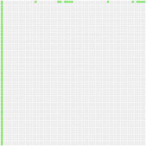

# CUDA memory access recorder and visualizer

This is a simple tool that records all memory accesses and timestamps of the accesses in a CUDA program.
It is done by writing every memory access index and streaming multiprocessor clock cycle value during the access into global device memory.
Depending on the amount of memory accesses, this might require quite a lot of space and makes this tool usable only on very small datasets.

## Examples

Note, the first two examples are running 4 thread blocks on 4 streaming multiprocessors (SM) but the last two used only a single SM for a single thread block.

Baseline approach with a memory access pattern that uses many short cachelines, which leads to poor memory transaction coalescing ([source](http://ppc.cs.aalto.fi/ch4/v0/)):



Slightly adjusted access pattern where thread warps are accessing consecutive memory addresses, leading to fewer, wider memory transactions ([source](http://ppc.cs.aalto.fi/ch4/v1/)):


Reduced amount of memory accesses by reusing data in registers ([source](http://ppc.cs.aalto.fi/ch4/v2/)).
The input data has been copied and transposed to enable a linear memory access pattern for both row- and column-wise accesses:


Buffering memory accesses through shared memory ([source](http://ppc.cs.aalto.fi/ch4/v3/)):


## Quickstart

To generate access patterns for the examples seen above, go to
```sh
cd examples/v0
make && ./bin/main
```
Start a local web server for the animation app:
```sh
cd ../../web && python3 -m http.server
```
Go to http://0.0.0.0:8000 and submit the generated `examples/v0/access-patterns-v0.json` file.

You should now see the access pattern from the first gif.

To use the v1 kernel, open [`examples/v0/main.cu`](examples/v0/main.cu) and define the `kernel_v1` macro instead of `kernel_v0`.

## If it does not work

Some things to try:

* Make sure you are running wrapper `AccessCounter` first, then `PatternRecorder`.
* The wrapper objects support only array indexing, pointer arithmetic etc. is not available.
* Make sure the wrapper object calls `enter_kernel` **once** somewhere at the beginning of a kernel before the first memory access.
* Make sure you call `cudaDeviceSynchronize` after the kernel call so that the unified memory pointers are accessible at the host.
* Define the value of macro `PR_VERBOSITY` as 1 before including `pattern_recorder.cuh`. This will trigger some asserts.
* If you are getting a warning of possibly using too much device memory, try reducing the number of required memory accesses by using a smaller data sample.
